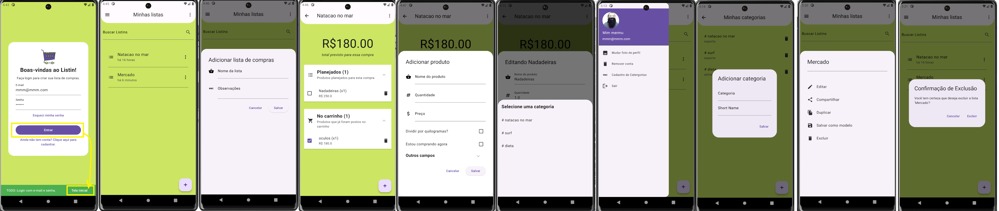

 
 # Flutter_Listin

 Este projeto é fruto do curso de 'Persistência de dados com Drift e Hive' da plataforma ALURA
 
## Introdução

O projeto Listin é um gerenciador de listas de compras para que você possa criar listas, sejam elas de supermercado, compras etc. Sendo o objetivo do curso ser o desenvolvimento da persistência usando o Drift e o Hive, o projeto se inicia com seu front-end definido utilizando dados mockados.



```bash

obs: como desafio, foi dada a tarefa de desenvolvimento da lista de categorias e sua aplicação 
     assim como a confirmação da exclusão da lista

```

### Tópicos abordados no projeto:

- O que é persistência de dados;
- Banco de dados relacional e não relacional;
- Como instalar e configurar o Drift;
- Operações básicas usando o Drift;
- Como instalar e configurar o Hive;
- Operações básicas usando o Hive;

## 📑 Requisitos

- Conhecimentos básicos de Flutter e Dart;
 
## ✨ Funcionalidades do projeto

- Configuração do Drift no Flutter;
- Implementação da adição, leitura, edição e remoção de "Listins" usando o Drift;
- Configuração do Hive no Flutter;
- Implementação da adição, leitura, edição e remoção dos produtos usando o Hive;

  